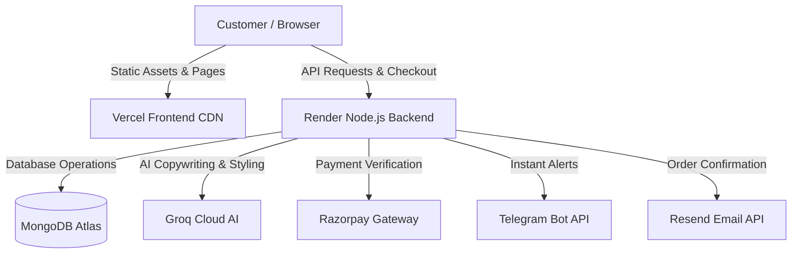

# 🛍️ MoreTrendz — Modern Full-Stack E-Commerce Platform

[](https://vitejs.dev/)
[](https://vuejs.org/)
[](https://nodejs.org/)
[](https://expressjs.com/)
[](https://www.mongodb.com/)
[](https://groq.com/)
[](https://razorpay.com/)
[](https://vercel.com/)
[](https://render.com/)

---

## 🌟 Overview

**MoreTrendz** is a high-performance, full-stack e-commerce web application engineered for speed, conversion, and seamless store management. Built with a responsive **Vite + Vue 3** frontend and a robust **Express + MongoDB Atlas** backend, it features real-time payment processing via **Razorpay**, automated **Telegram order alerts**, transactional **Resend emails**, and generative **Groq AI** for automated product copywriting and personalized cart suggestions.

---

## ✨ Key Features

### 🛒 Customer Experience
- **⚡ Ultra-Fast Multi-Page Storefront**: Powered by Vite with zero layout shift and instant page navigation.
- **💳 Dual Payment Options**:
  - **Online Payments**: Instant UPI, Credit/Debit Cards, NetBanking, and Wallets via Razorpay.
  - **Cash on Delivery (COD)**: 1-click checkout with automated order confirmation.
- **🤖 Groq AI Shopping Assistant**: Real-time intelligent cart bundling and outfit/accessory recommendations using `openai/gpt-oss-120b`.
- **🏷️ Dynamic Discount Engine**: Promo code validation with percentage discounts and real-time total recalculations.
- **⭐ Customer Reviews & Ratings**: Interactive star ratings with moderation controls.
- **🔍 Instant Search & Filtering**: Fast product catalog search with instant feedback.

### 🛡️ Admin Dashboard (`/admin_login.html`)
- **📦 Product Management**: Create, edit, feature, and delete products with rich HTML descriptions (Quill Editor) and image uploads.
- **✍️ AI Product Description Generator**: Generate high-converting e-commerce product copy in seconds using Groq AI.
- **📋 Live Order Management**: View all customer orders, filter by status, and update payment/delivery statuses.
- **🎟️ Promo Code Management**: Create and track discount coupons with custom percentage discounts.
- **💬 Review Moderation**: View, approve, or remove customer feedback.

### 🔔 Automated Notifications
- **📱 Real-Time Telegram Alerts**: Instant notifications sent to your Telegram bot for every placed order (with complete customer details, itemized breakdown, and shipping address) and contact form inquiry.
- **📧 Transactional Emails**: Automated order confirmation emails sent via **Resend API**.

---

## 🏗️ Architecture



---

## 🚀 Quick Start (Local Development)

### 1. Prerequisites
- **Node.js** (v18.0.0 or higher)
- **npm** (v9.0.0 or higher)
- **MongoDB Atlas** database URI

---

### 2. Clone the Repository
```bash
git clone https://github.com/GauravRawat05/moretrendz-website.git
cd moretrendz-website
```

---

### 3. Backend Setup

1. Navigate to the backend directory:
   ```bash
   cd backend
   ```
2. Install dependencies:
   ```bash
   npm install
   ```
3. Create a `.env` file in the `backend/` directory:
   ```env
   PORT=5000
   MONGO_URI="mongodb+srv://<username>:<password>@cluster0.mongodb.net/?retryWrites=true&w=majority"
   JWT_SECRET="your_jwt_secret_key"
   ADMIN_EMAIL="moretrendz@admin"
   ADMIN_PASSWORD="your_admin_password"
   GROQ_API_KEY="gsk_your_groq_api_key"
   RAZORPAY_KEY_ID="rzp_live_your_key_id"
   RAZORPAY_KEY_SECRET="your_razorpay_secret"
   RESEND_API_KEY="re_your_resend_key"
   TELEGRAM_BOT_TOKEN="your_telegram_bot_token"
   TELEGRAM_CHAT_ID="your_telegram_chat_id"
   IMGBB_API_KEY="your_imgbb_key"
   ```
4. Start the backend server:
   ```bash
   npm start
   ```
   *Backend will run on **`http://localhost:5000`**.*

---

### 4. Frontend Setup

1. Open a new terminal in the root directory:
   ```bash
   cd moretrendz-website
   ```
2. Install dependencies:
   ```bash
   npm install
   ```
3. Start the Vite development server:
   ```bash
   npm run dev
   ```
   *Frontend will run on **`http://localhost:5173`**.*

---

## 🔑 Accessing the Admin Dashboard

1. Open your browser and navigate to:
   - **Local**: `http://localhost:5173/admin_login.html`
   - **Live**: `https://your-vercel-domain.vercel.app/admin_login.html`
2. Enter your Admin credentials (configured in `.env` / Render):
   - **Email**: `moretrendz@admin`
   - **Password**: *(Configured `ADMIN_PASSWORD` in your backend environment)*
3. You will be redirected to `admin-dashboard.html` with full store controls.

---

## ⚙️ Environment Variables Reference

| Variable | Environment | Description |
| :--- | :--- | :--- |
| `PORT` | Backend | Port number for Express server (default `5000`). |
| `MONGO_URI` | Backend | MongoDB Atlas connection string. |
| `JWT_SECRET` | Backend | Secret string used for signing Admin auth tokens. |
| `ADMIN_EMAIL` | Backend | Admin login email. |
| `ADMIN_PASSWORD` | Backend | Admin login password. |
| `GROQ_API_KEY` | Backend | API Key for Groq Cloud AI (`openai/gpt-oss-120b`). |
| `RAZORPAY_KEY_ID` | Backend & Frontend | Razorpay Public Key ID (`rzp_live_...`). |
| `RAZORPAY_KEY_SECRET`| Backend | Razorpay Secret Key for HMAC signature verification. |
| `RESEND_API_KEY` | Backend | API key for transactional emails via Resend. |
| `TELEGRAM_BOT_TOKEN` | Backend | Telegram Bot token for instant order/contact alerts. |
| `TELEGRAM_CHAT_ID` | Backend | Admin Chat ID to receive Telegram messages. |
| `IMGBB_API_KEY` | Backend | API Key for product image hosting via ImgBB. |
| `VITE_RAZORPAY_KEY` | Frontend (Vercel) | Public Razorpay key exposed to browser for popup modal. |

---

## 🌐 Production Deployment

### **Frontend (Vercel)**
1. Connect GitHub repository to [Vercel](https://vercel.com/new).
2. Framework Preset: **Vite** | Root Directory: `./`.
3. Add Environment Variable:
   - `VITE_RAZORPAY_KEY` = `rzp_live_...`
4. Deploy!

### **Backend (Render)**
1. Create a **Web Service** on [Render](https://dashboard.render.com/).
2. Root Directory: `backend` | Runtime: `Node`.
3. Build Command: `npm install` | Start Command: `node server.js`.
4. Add all environment variables listed above.
5. Setup a free 10-minute ping monitor on [UptimeRobot](https://uptimerobot.com) to `https://your-backend.onrender.com/api/health` to keep the server awake 24/7.

---

## 📂 Project Structure

```text
moretrendz-website/
├── backend/
│   ├── middleware/        # Admin JWT authentication middleware
│   ├── models/            # Mongoose models (Order, Product, Review, Discount)
│   ├── routes/            # Express routes (Products, AI, Orders, Admin, Reviews)
│   ├── services/          # Telegram notifications & Resend email service
│   ├── package.json       # Backend dependencies
│   └── server.js          # Express app entry point & CORS configuration
├── js/
│   ├── components/        # Vue 3 components (Header, ProductGrid, Reviews)
│   ├── checkout.js        # Checkout & Razorpay payment handler
│   ├── config.js          # Dynamic environment-aware API URL resolver
│   ├── home.js            # Homepage scripts
│   ├── main.js            # Core bootstrap and UI utilities
│   └── product-page.js    # Single product details & gallery handler
├── index.html             # Store Homepage
├── cart.html              # Shopping Cart & AI Stylist
├── checkout.html          # Checkout & Payment Page
├── product.html           # Product Detail View
├── admin_login.html       # Admin Portal Login
├── admin-dashboard.html   # Admin Management Panel
├── contact.html           # Customer Contact Form
├── search-results.html    # Search Results Page
├── style.css              # Global styles & Tailwind utilities
├── tailwind.config.js     # Tailwind CSS configuration
├── vite.config.js         # Vite multi-page build configuration
└── package.json           # Frontend dependencies
```

---

## 📄 License

This project is licensed under the **ISC License**.
